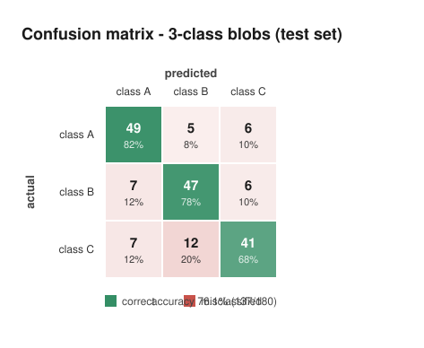
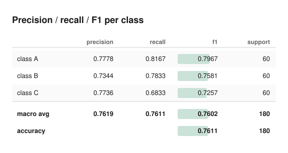

# Neural Network From Scratch — in Pure Python

A complete, working neural network framework built with **nothing but Python's
standard library**. No NumPy. No PyTorch. No TensorFlow. No autodiff.

Every matrix multiplication is a loop you can read. Every derivative was
worked out by hand and is written down next to the code that implements it.
Every gradient is verified against the definition of a derivative.

```python
from scratch_nn import Sequential, Dense, Adam, set_seed

set_seed(42)
model = Sequential([
    Dense(2, 8, activation="tanh"),
    Dense(8, 8, activation="tanh"),
    Dense(8, 1, activation="sigmoid"),
])
model.compile(loss="binary_cross_entropy", optimizer=Adam(0.05),
              metrics=["accuracy"])

model.fit(X, y, epochs=500, batch_size=4)
model.predict([[0, 1]])       # -> 0.9998
```

---

## Table of contents

**Getting started** — [Install](#install) · [Quick start](#quick-start) ·
[The CLI](#the-command-line-interface) · [Project layout](#project-layout)

**The theory, from first principles**
1. [What is a neural network?](#1-what-is-a-neural-network)
2. [Neurons](#2-neurons)
3. [Weights and biases](#3-weights-and-biases)
4. [Forward propagation](#4-forward-propagation)
5. [Activation functions](#5-activation-functions)
6. [Loss functions](#6-loss-functions)
7. [Gradient descent](#7-gradient-descent)
8. [Backpropagation](#8-backpropagation)
9. [The chain rule](#9-the-chain-rule)
10. [Weight initialization](#10-weight-initialization)
11. [Optimizers](#11-optimizers)
12. [Regularization](#12-regularization)
13. [Overfitting](#13-overfitting)
14. [Validation](#14-validation)
15. [Numerical stability](#15-numerical-stability)
16. [Gradient checking](#16-gradient-checking)
17. [The training loop](#17-the-training-loop)
18. [Evaluation — beyond accuracy](#18-evaluation--beyond-accuracy)
19. [Inference](#19-inference)

**Reference** — [Tracing one example end to end](#tracing-one-example-end-to-end) ·
[API](#api-reference) · [Testing](#testing) · [Limitations](#known-limitations) ·
[Future work](#possible-improvements)

---

## Install

There is nothing to install. Clone the repository and run it.

```bash
git clone https://github.com/Sagexd08/Neural-Network-From-Scratch-Ft.-Python.git
cd Neural-Network-From-Scratch-Ft.-Python/scratch_nn
python -m scratch_nn xor
```

Requires **Python 3.8 or newer** and nothing else. `requirements.txt` is
deliberately empty.

To import `scratch_nn` from your own code, either run from the `scratch_nn/`
directory with `PYTHONPATH=src`, or install it in editable mode:

```bash
pip install -e .      # only wires up the import path; still pulls in no dependencies
```

## Quick start

```bash
python -m scratch_nn xor              # train a network on XOR
python -m scratch_nn demo             # one sample, every intermediate value
python -m scratch_nn gradient-check   # prove backpropagation is correct
python -m scratch_nn test             # run the 315-test suite

python examples/xor.py                     # XOR, with a decision-boundary plot
python examples/binary_classification.py   # the full CSV pipeline
python examples/multiclass_classification.py
python examples/confusion_graph.py         # confusion matrix, SVG graph, F1
```

## The command-line interface

| Command | What it does |
|---|---|
| `python -m scratch_nn xor` | Trains on XOR and prints the truth table |
| `python -m scratch_nn demo` | Traces one sample through forward, backward, and the weight update |
| `python -m scratch_nn gradient-check` | Verifies every layer's gradients against finite differences |
| `python -m scratch_nn train --data data.csv` | Full pipeline on a CSV |
| `python -m scratch_nn predict --model m.json --input "5.1,3.5"` | Inference with a saved model |
| `python -m scratch_nn test` | Runs the unit tests |

Useful flags: `--epochs`, `--batch-size`, `--lr`, `--optimizer`, `--hidden`,
`--l2`, `--dropout`, `--clip-norm`, `--patience`, `--save`, `--seed`.

## Project layout

```
scratch_nn/
├── src/scratch_nn/
│   ├── tensor.py           N-d arrays on flat Python lists; matmul, broadcasting
│   ├── activations.py      ReLU, sigmoid, tanh, softmax, ELU, GELU, Swish + derivatives
│   ├── initialization.py   Xavier, He, LeCun — and why the scale matters
│   ├── layers.py           Dense, Dropout, BatchNorm, Flatten, Residual + the backprop derivation
│   ├── losses.py           MSE, MAE, BCE, categorical cross-entropy, Huber
│   ├── optimizers.py       SGD, Momentum, Adam, RMSProp, AdaGrad
│   ├── model.py            Sequential: forward/backward orchestration
│   ├── numerical.py        Finite-difference gradient checking
│   ├── training.py         Training loop, early stopping, checkpoints, LR schedules
│   ├── data.py             CSV, splitting, scaling, one-hot encoding
│   ├── metrics.py          Accuracy, precision, recall, F1, confusion matrix + SVG graph, R²
│   ├── serialization.py    Human-readable JSON checkpoints (and .pkl export)
│   ├── utils.py            Seeding, numerical guards, ASCII plotting
│   └── __main__.py         CLI
├── examples/               xor.py, binary_classification.py, multiclass_classification.py,
│                          confusion_graph.py
├── reports/                generated confusion graph and scorecard
├── tests/                  315 unit tests
└── models/                 saved checkpoints
```

---

# The theory, from first principles

## 1. What is a neural network?

A neural network is a **function** — it takes numbers in and gives numbers
out — with two properties that make it useful:

1. It has adjustable parameters (weights).
2. There is an efficient algorithm for choosing those parameters so the
   function matches examples you have.

That is the whole idea. "Learning" means searching for parameter values that
make the function's outputs match known answers, in the hope it then works on
inputs you have never seen.

Formally, a network computes a composition of simple functions:

```
output = f_n( ... f_2( f_1(input) ) ... )
```

Each `f_i` is one layer. Each layer does something simple — multiply by a
matrix, add a vector, apply a curve — and the power comes from stacking them.

**Why this is worth doing.** The *universal approximation theorem* says a
network with one hidden layer and enough units can approximate any continuous
function to arbitrary precision. In practice depth is more efficient than
width: deep networks build hierarchies, where early layers find simple
patterns and later layers combine them into complex ones.

## 2. Neurons

A neuron is the smallest unit. It:

1. receives several numbers,
2. multiplies each by a weight and adds them up,
3. adds a bias,
4. passes the result through a nonlinear function.

```
        x₁ ──w₁──┐
        x₂ ──w₂──┼──► Σ(wᵢxᵢ) + b ──► activation ──► output
        x₃ ──w₃──┘
```

In symbols:

```
z = w₁x₁ + w₂x₂ + ... + wₙxₙ + b
a = activation(z)
```

`z` is the **pre-activation**; `a` is the **activation**.

Geometrically, `z = 0` defines a hyperplane in the input space — a line in 2D,
a plane in 3D. The weights set its orientation and the bias sets its offset.
One neuron divides the input space in two. A layer of neurons divides it many
ways at once, and later layers combine those pieces into arbitrary regions.

In code — [`layers.py`](src/scratch_nn/layers.py) — a whole layer of neurons
is computed at once, because a matrix multiply is exactly "many weighted sums
in parallel."

## 3. Weights and biases

**Weights** measure influence. A large positive `w₁` means "when x₁ goes up,
this neuron fires harder"; a negative one means the opposite; near zero means
"ignore this input." Weights are what the network learns.

**Biases** shift the threshold. Without one, `z = Σwᵢxᵢ` is zero whenever the
input is zero, so every decision boundary would be forced through the origin.
The bias frees it:

```
z = w·x + b      the boundary z = 0 sits wherever b puts it
```

A layer with `n` inputs and `m` outputs has an `n × m` weight matrix and `m`
biases — `n·m + m` numbers in total. The convention used here is:

```
W[i][j] = the weight from input i to output unit j
```

which makes the forward pass a plain `X @ W` when `X` holds one sample per row.

**Biases start at zero, weights must not.** See
[§10 Initialization](#10-weight-initialization) for why.

## 4. Forward propagation

Forward propagation is running the network: push the input through each layer
in order.

For a batch of samples `X` with shape `(batch, in_features)`:

```
Z = X @ W + b          shape (batch, out_features)
A = activation(Z)
```

Written out for one sample `n` and one output unit `j`:

```
Z[n][j] = Σᵢ X[n][i] · W[i][j] + b[j]
```

**Why batches.** Processing many samples at once turns many small vector
operations into one matrix operation, which is both faster and gives a less
noisy gradient estimate.

**The implementation** — [`layers.py:Dense.forward`](src/scratch_nn/layers.py):

```python
z = x.matmul(self.W)              # Z = X @ W

if self.use_bias:                 # + b, broadcast across the batch
    zd, bd = z.data, self.b.data
    for n in range(z.shape[0]):
        base = n * cols
        for j in range(cols):
            zd[base + j] += bd[j]

self._input = x                   # cached, because backward needs it
self._pre_activation = z
return self.activation.forward(z)
```

And the matrix multiply itself — [`tensor.py:matmul`](src/scratch_nn/tensor.py)
— is the definition, three loops deep:

```python
for i in range(n):
    for j in range(m):
        acc = 0.0
        for p in range(k):
            acc += a[i*k + p] * b[p*m + j]      # C[i][j] = Σₚ A[i][p]·B[p][j]
        out[i*m + j] = acc
```

**Example.** With `X = [[1, 2]]`, `W = [[1, 2], [3, 4]]`, `b = [10, 20]`:

```
Z = [1·1 + 2·3,  1·2 + 2·4] + [10, 20]
  = [7, 10] + [10, 20]
  = [17, 30]
```

## 5. Activation functions

**Why they are mandatory.** Without a nonlinearity, stacked layers collapse:

```
(X·W₁ + b₁)·W₂ + b₂  =  X·(W₁W₂) + (b₁W₂ + b₂)  =  X·W' + b'
```

Fifty linear layers have exactly the power of one. XOR would be unsolvable
forever. The activation function is what breaks the collapse.

### ReLU — `f(x) = max(0, x)`

```
f'(x) = 1  if x > 0
        0  if x < 0
```

The default for hidden layers. Its gradient is exactly 1 across the whole
positive half-line, which is what makes deep networks trainable: sigmoid and
tanh have derivatives that *shrink* as inputs grow, so multiplying them layer
after layer drives gradients to zero.

Its failure mode is the **dying ReLU** — a unit pushed permanently negative
has zero gradient forever and can never recover. Leaky ReLU fixes it.

```python
for i in range(len(data)):
    v = data[i]
    if v > 0.0:
        out[i] = v
        mask[i] = 1.0        # cache the derivative for backward
```

### Sigmoid — `σ(x) = 1 / (1 + e⁻ˣ)`

Squashes any real number into `(0, 1)`, so the output reads as a probability.

Its derivative is one of the tidiest results in the subject:

```
σ'(x) = σ(x) · (1 − σ(x))
```

<details>
<summary>Where that comes from</summary>

Write `σ = (1 + e⁻ˣ)⁻¹`. By the chain rule,

```
dσ/dx = −(1 + e⁻ˣ)⁻² · (−e⁻ˣ) = e⁻ˣ / (1 + e⁻ˣ)²
```

Split the product:

```
= [1/(1+e⁻ˣ)] · [e⁻ˣ/(1+e⁻ˣ)] = σ · (1 − σ)
```

because `e⁻ˣ/(1+e⁻ˣ) = 1 − 1/(1+e⁻ˣ)`.
</details>

So the backward pass needs only the cached *output* — no exponentials at all.

**Numerical stability.** The naive formula computes `e⁻ˣ`, which overflows
around `x = −745`. The fix branches on the sign so only non-positive numbers
are ever exponentiated:

```python
if x >= 0.0:
    return 1.0 / (1.0 + safe_exp(-x))     # e⁻ˣ ≤ 1, safe
e = safe_exp(x)                            # e ˣ ≤ 1, safe
return e / (1.0 + e)
```

### Tanh — `tanh(x)`, derivative `1 − tanh²(x)`

Like sigmoid but squashing into `(−1, 1)` and **zero-centred**. That matters:
sigmoid's outputs are all positive, so every weight gradient in the next layer
shares one sign and the optimizer zig-zags. Tanh is the better of the two for
hidden layers.

### Softmax — a distribution over classes

```
pᵢ = e^(zᵢ) / Σⱼ e^(zⱼ)
```

Every `pᵢ > 0` and each row sums to exactly 1.

**The stability trick.** Softmax is unchanged by shifting all inputs by a
constant:

```
e^(zᵢ−c) / Σⱼ e^(zⱼ−c) = [e⁻ᶜ·e^(zᵢ)] / [e⁻ᶜ·Σⱼ e^(zⱼ)] = e^(zᵢ) / Σⱼ e^(zⱼ)
```

Choosing `c = max(z)` makes the largest exponent exactly `e⁰ = 1`, so nothing
can overflow. Without it, `softmax([1000, 1001, 1002])` is `inf/inf = nan`;
with it, the answer is the same as `softmax([1, 2, 3])`.

**Its gradient is not element-wise.** Every output depends on every input:

```
∂pᵢ/∂zⱼ = pᵢ(δᵢⱼ − pⱼ)
```

The vector-Jacobian product needed for backprop is

```
dL/dzᵢ = pᵢ · ( dL/dpᵢ − Σⱼ dL/dpⱼ·pⱼ )
```

which costs O(classes) per row — the full Jacobian is never built.

### Also implemented

**Leaky ReLU** (`x` if `x>0` else `αx`), **ELU**, **GELU** (the tanh
approximation used by GPT/BERT), **Swish/SiLU** (`x·σ(βx)`).

| Use | Choose |
|---|---|
| Hidden layers, default | ReLU (or Leaky ReLU if units are dying) |
| Hidden layers, small/shallow nets | Tanh |
| Binary classification output | Sigmoid |
| Multiclass output | Softmax |
| Regression output | Identity (no squashing) |

## 6. Loss functions

The loss is one number saying how wrong the network is. Training minimises it.

### Mean squared error — regression

```
L = (1/N) Σ (ŷ − y)²             dL/dŷ = (2/N)(ŷ − y)
```

Errors are punished quadratically, so outliers dominate. The factor of 2 is
real — this library keeps it rather than absorbing it into a `½`, so the
analytical gradient matches a numerical check of the *actual* forward
function.

### Binary cross-entropy — two classes

```
L = −[ y·log(p) + (1−y)·log(1−p) ]
```

Only one term survives for a hard label. If `y = 1` the loss is `−log(p)`:
zero when `p = 1`, rising without bound as `p → 0`.

**Why not MSE for classification?** Combined with sigmoid, MSE's gradient
contains a factor of `σ'(z)`, which is ≈0 exactly when the network is
confidently wrong — precisely when you need a large update. Cross-entropy's
`log` cancels that factor:

```
dL/dp = (1/N)·(p − y) / (p(1−p))
dp/dz = p(1−p)                      ← sigmoid's derivative
dL/dz = (1/N)·(p − y)               ← they cancel exactly
```

A confident mistake now produces a correspondingly large gradient.

### Categorical cross-entropy — many classes

```
L = −Σᵢ yᵢ·log(pᵢ)
```

With a one-hot target this is just `−log(probability of the true class)`.

**The fused gradient.** When softmax feeds cross-entropy, composing the two
Jacobians collapses everything:

```
dL/dz = p − y
```

"Predicted minus actual." No division, no exponentials, nothing that can
overflow. `Sequential` detects this pairing automatically and takes the fused
path — see `_fused_softmax_ce` in [`model.py`](src/scratch_nn/model.py).

### Also implemented

**MAE** (robust to outliers, constant gradient magnitude) and **Huber**
(quadratic near zero, linear far away — spliced so both the value and the
first derivative agree at the join).

### The batch-size convention

Every loss here **averages** over the batch, and its gradient is divided by
the same `N`. Keeping them consistent is what makes the gradient the true
derivative of the reported loss — and is exactly what gradient checking
verifies. It also means changing `batch_size` does not require retuning the
learning rate.

## 7. Gradient descent

The gradient `∂L/∂w` is the slope of the loss with respect to one weight: how
much the loss changes per unit change in that weight. It points in the
direction of steepest *increase*, so we step the other way:

```
w ← w − η · ∂L/∂w
```

`η` is the **learning rate**, and it is the hyperparameter that matters most:

- **too large** — the step overshoots the valley; the loss oscillates or
  diverges to `nan`
- **too small** — correct, but training takes forever

**How much data per step?**

| Mode | Batch size | Character |
|---|---|---|
| Full batch | all of it | exact gradient, smooth, one update per epoch |
| Mini-batch | 32 | the usual compromise — the default here |
| Stochastic | 1 | noisy, many updates; the noise helps escape sharp minima |

## 8. Backpropagation

Backpropagation answers: *given the loss, how should each of the thousands of
weights change?* Computing each derivative independently would need one
forward pass per weight. Backprop gets all of them in **one** backward pass.

The insight: each layer needs only one thing from its successor — `dL/d(my
output)`. From that it can compute its own parameter gradients *and*
`dL/d(my input)`, which is exactly what the layer before it needs.

### The Dense layer's four steps

Given `dL/dA` (the gradient w.r.t. this layer's output):

**Step 1 — back through the activation.** It is element-wise:

```
dL/dZ = dL/dA ⊙ activation'(Z)
```

**Step 2 — the weight gradient.** `W[i][j]` affects the loss through `Z[n][j]`
for *every* sample `n`, so the multivariable chain rule sums those paths:

```
dL/dW[i][j] = Σₙ dL/dZ[n][j] · ∂Z[n][j]/∂W[i][j]
            = Σₙ X[n][i] · dL/dZ[n][j]
```

That sum is exactly the `(i,j)` entry of a matrix product:

```
dW = Xᵀ @ dZ                (in, batch) @ (batch, out) → (in, out)
```

**Step 3 — the bias gradient.** `∂Z[n][j]/∂b[j] = 1`, so the paths just add:

```
db[j] = Σₙ dL/dZ[n][j]      column sums of dZ → (out,)
```

**Step 4 — the input gradient.** `X[n][i]` feeds every output unit `j`:

```
dL/dX[n][i] = Σⱼ dL/dZ[n][j] · W[i][j]

dX = dZ @ Wᵀ                (batch, out) @ (out, in) → (batch, in)
```

Note the symmetry: **forward multiplies by `W`, backward multiplies by `Wᵀ`.**

### The implementation

[`layers.py:Dense.backward`](src/scratch_nn/layers.py) — written as explicit
loops so the sum over the batch axis is visible:

```python
# Step 2: dW = Xᵀ @ dZ
for i in range(in_size):
    for j in range(out_size):
        acc = 0.0
        for n in range(batch):
            acc += xd[n*in_size + i] * dzd[n*out_size + j]
        dwd[i*out_size + j] += acc         # += so gradients accumulate

# Step 3: db = column sums of dZ
for j in range(out_size):
    acc = 0.0
    for n in range(batch):
        acc += dzd[n*out_size + j]
    dbd[j] += acc

# Step 4: dX = dZ @ Wᵀ
for n in range(batch):
    for i in range(in_size):
        acc = 0.0
        for j in range(out_size):
            acc += dzd[n*out_size + j] * wd[i*out_size + j]
        dx[n*in_size + i] = acc
```

### The whole loop over the network

[`model.py:Sequential.backward`](src/scratch_nn/model.py) is nine lines:

```python
grad = self.loss.backward(y_pred, y_true)      # dL/d(final output)
for layer in reversed(self.layers):
    grad = layer.backward(grad)                # each returns dL/d(its input)
```

## 9. The chain rule

Backpropagation *is* the chain rule, applied to a composition.

If `L` depends on `a`, which depends on `z`, which depends on `w`:

```
dL/dw = dL/da · da/dz · dz/dw
```

For a network, the chain stretches through every layer:

```
dL/dW₁ = dL/dAₙ · dAₙ/dAₙ₋₁ · ... · dA₂/dA₁ · dA₁/dW₁
```

Computing that product **left to right** is what makes backprop efficient:
each step only needs the accumulated `dL/d(current layer's output)`.

**Concretely, through a two-layer network:**

```
x ──► z₁ = xW₁+b₁ ──► a₁ = relu(z₁) ──► z₂ = a₁W₂+b₂ ──► p = σ(z₂) ──► L

dL/dp   = (p − y) / (p(1−p))       from the loss
dL/dz₂  = dL/dp · p(1−p) = p − y   through sigmoid — the p(1−p) cancels
dL/dW₂  = a₁ᵀ @ dL/dz₂
dL/da₁  = dL/dz₂ @ W₂ᵀ             handed back to the ReLU
dL/dz₁  = dL/da₁ ⊙ (z₁ > 0)        through ReLU
dL/dW₁  = xᵀ @ dL/dz₁
```

`python -m scratch_nn demo` prints every one of these numbers for a real
sample.

**Why gradients vanish or explode.** That chain is a *product*. Multiply
twenty numbers that are each ~0.25 (sigmoid's maximum derivative) and you get
10⁻¹²: the early layers stop learning. Multiply twenty numbers that are each
1.5 and you get 3300: the update explodes. This single fact motivates ReLU
(§5), careful initialization (§10), BatchNorm, residual connections, and
gradient clipping (§15).

## 10. Weight initialization

It looks like a detail. It decides whether learning happens at all.

### Failure 1: all zeros

If every weight in a layer is 0, every unit computes the same output, receives
the same gradient, and takes the same step. They stay identical forever. A
128-unit layer has the power of a 1-unit layer. This is the **symmetry
problem**, and it is why weights must start random.

Biases *may* start at zero — they are already distinguished by the weights
feeding them.

### Failure 2: the wrong scale

Consider the variance of a pre-activation `z = Σ wᵢxᵢ` over `fan_in` inputs:

```
Var(z) = fan_in · Var(w) · Var(x)
```

The signal is multiplied by `fan_in · Var(w)` at every layer. Below 1, the
activations shrink geometrically with depth until they are numerically zero.
Above 1, they explode. The same factor applies to gradients on the way back.

Every scheme below answers: **choose `Var(w)` so that factor is 1.**

| Scheme | Variance | Use with |
|---|---|---|
| **Xavier/Glorot** | `2/(fan_in + fan_out)` | tanh, sigmoid |
| **He/Kaiming** | `2/fan_in` | ReLU and relatives |
| **LeCun** | `1/fan_in` | forward-only preservation |

**Xavier** compromises between the forward requirement (`1/fan_in`) and the
backward one (`1/fan_out`). **He** adds a factor of 2 because ReLU zeroes half
its inputs, halving the variance passing through — the 2 compensates exactly.

For a uniform distribution on `[−L, L]` the variance is `L²/3`, so the
familiar limits fall out:

```
Xavier uniform:  L = √(6/(fan_in + fan_out))       (6 = 3 × 2)
He uniform:      L = √(6/fan_in)
```

**Rule of thumb: He for ReLU, Xavier for tanh/sigmoid.**

```python
Dense(input_size=4, output_size=8, initialization="he")
```

## 11. Optimizers

### SGD

```
W ← W − η·g
```

The whole algorithm. Its weakness: it uses only the current gradient, so in a
ravine (steep across, shallow along) it bounces between the walls while
creeping along the floor.

### Momentum

```
v ← βv + g
W ← W − η·v
```

Keep a running velocity and step along that. `β = 0.9` acts like inertia.

Components that keep pointing the same way accumulate — with `β = 0.9` a
consistent direction reaches roughly `1/(1−β) = 10×` the speed of SGD.
Components that flip sign each step cancel out. So momentum damps the
oscillation and accelerates the useful direction simultaneously.

*Nesterov* evaluates the gradient where the momentum is about to take you
rather than where you are, giving it a chance to correct before overshooting.

### AdaGrad and RMSProp

```
AdaGrad:  s ← s + g²             W ← W − η·g/(√s + ε)
RMSProp:  s ← ρs + (1−ρ)g²       W ← W − η·g/(√s + ε)
```

Divide by the accumulated gradient magnitude, so parameters with large
gradients get small steps. AdaGrad's `s` only grows, so its learning rate
decays to zero and learning stops; RMSProp's moving average fixes that.

### Adam — momentum and RMSProp combined

**Step 1 — two moment estimates:**

```
mₜ = β₁mₜ₋₁ + (1−β₁)g          1st moment: the mean
vₜ = β₂vₜ₋₁ + (1−β₂)g²         2nd moment: the variance
```

**Step 2 — bias correction.** Both start at zero, which biases them toward
zero early on. After one step with `β₁ = 0.9`, `m₁ = 0.1g` — a tenth of the
true gradient, so the model would barely move exactly when it should move
most. Expanding the recursion gives `E[mₜ] = (1 − β₁ᵗ)·E[g]`, so dividing by
that factor removes the bias exactly:

```
m̂ = mₜ / (1 − β₁ᵗ)
v̂ = vₜ / (1 − β₂ᵗ)
```

At `t = 1` this rescales `0.1g` back to `g`; as `t` grows, `βᵗ → 0` and the
correction fades to a no-op.

**Step 3 — the update:**

```
W ← W − η · m̂ / (√v̂ + ε)
```

Read the ratio as "gradient divided by its own typical magnitude": each
parameter gets a step scaled to its own history, which is why `η = 0.001` is
a reliable default for Adam where SGD needs per-problem tuning.

| Optimizer | Default LR | When |
|---|---|---|
| SGD | 0.01–0.5 | simple problems; when you want to understand what happens |
| Momentum | 0.01–0.1 | SGD that keeps stalling |
| **Adam** | **0.001** | **the default — start here** |
| RMSProp | 0.001 | recurrent nets |

## 12. Regularization

Regularization trades a little training accuracy for better generalization.

### L2 (weight decay)

```
L_total = L_data + λ·Σw²         ∂/∂w = 2λw
```

Penalises large weights, preferring many small ones over a few dominant ones.
A model relying heavily on one feature is fragile; spreading the reliance
generalizes better.

### L1

```
L_total = L_data + λ·Σ|w|        ∂/∂w = λ·sign(w)
```

The gradient has constant magnitude regardless of weight size, so small
weights get pushed all the way to *exactly* zero — L1 performs feature
selection. L2's gradient shrinks with the weight, so it shrinks without
eliminating.

Neither penalises biases: a bias cannot cause overfitting the way a weight can.

### Dropout

```
training:   mask ~ Bernoulli(1−rate);   a = x·mask/(1−rate)
inference:  a = x
```

Randomly zero a fraction of activations each step. Since any input may vanish,
no unit can rely on a specific partner, so the network builds redundant
representations.

The `/(1−rate)` is **inverted dropout**: without it a unit sees an expected
input of `(1−rate)·x` in training but the full `x` at inference — a systematic
mismatch. Scaling up during training keeps the expectation equal in both
regimes, so inference needs no correction at all.

**Dropout must be off at inference.** This is the single most common dropout
bug, and it is why `forward()` takes an explicit `training` flag.

```python
Dense(4, 16, activation="relu", l2=1e-4)
Dropout(0.2)
```

## 13. Overfitting

An overfitted model has memorised the training set, including its noise,
instead of learning the pattern.

The signature is unmistakable:

```
training loss    ↓↓↓↓↓↓↓↓  keeps falling — memorisation always helps here
validation loss  ↓↓↓↑↑↑↑↑  falls, then turns and rises
                    ↑
                    the best model you will get
```

The gap between the two curves *is* the overfitting measure.

**What to do:** get more data; make the model smaller; add L2 or dropout;
stop early (§17). `examples/binary_classification.py` prints the gap
explicitly.

## 14. Validation

Split data **three** ways, because the three sets have different jobs:

| Split | Job | How often it is used |
|---|---|---|
| **Train** | fits the weights | every batch |
| **Validation** | decisions *about* training — when to stop, which hyperparameters | every epoch |
| **Test** | the final unbiased estimate | exactly once |

Reusing validation as test overstates performance, because the stopping point
was chosen to look good on exactly that data.

**Data leakage** is the subtler trap. Preprocessing must be *fitted* on
training data only:

```python
X_train, X_val, X_test = split(X)          # 1. split first
scaler = StandardScaler().fit(X_train)     # 2. learn from train alone
X_train = scaler.transform(X_train)        # 3. apply to all three
X_val   = scaler.transform(X_val)
X_test  = scaler.transform(X_test)
```

Fitting the scaler before splitting leaks the test distribution into training,
and your reported accuracy is optimistically biased. `Scaler.transform()`
raises if called before `fit()`, so the mistake is hard to make silently.

### Feature scaling

```
Standardization:  x' = (x − μ)/σ          zero mean, unit variance
Min-max:          x' = (x − min)/(max − min)
```

Why it matters: a gradient w.r.t. a weight is proportional to its input, so a
feature measured in thousands produces gradients a thousand times larger than
one measured in units. No single learning rate suits both.

Standardization is the safer default; min-max guarantees bounded output but a
single outlier defines the range and squashes everything else.

## 15. Numerical stability

Three classic failures, and the guards in
[`utils.py`](src/scratch_nn/utils.py):

| Problem | Where | Fix |
|---|---|---|
| `exp` overflows near 710 | softmax, sigmoid | subtract the row max; branch on sign |
| `log(0) = −inf` | every cross-entropy | clamp to `[ε, 1−ε]` |
| exploding gradients | deep nets | clip the global norm |

**Gradient clipping** rescales when the global norm gets too large:

```
if ‖g‖ > max_norm:
    g ← g · max_norm/‖g‖
```

Every gradient is scaled by the *same* factor, so the update **direction is
preserved exactly** — only its length is capped. That is why norm clipping
beats clipping each element independently, which would distort the direction.

```python
model.fit(X, y, clip_norm=5.0)
```

Also available: `is_finite()`, `check_finite()`, `gradient_norm()`,
`parameter_norm()`, `clip_by_value()`. Training calls `check_finite` after
every batch, so divergence is reported at the batch where it starts rather
than 200 epochs later when every weight is `nan`.

## 16. Gradient checking

**This is the quality gate for the whole project.** A subtly wrong gradient —
a transpose in the wrong place, a missing factor of 2 — still trains, just
worse. No exception, no obvious symptom. Gradient checking catches all of it.

Compare the analytical gradient against the definition of a derivative:

```
numerical ≈ [L(w + h) − L(w − h)] / (2h)
```

**Why the central difference.** The forward difference `[f(x+h) − f(x)]/h` has
error O(h). Expanding both terms of the central form:

```
f(x+h) = f(x) + hf'(x) + (h²/2)f''(x) + (h³/6)f'''(x) + ...
f(x−h) = f(x) − hf'(x) + (h²/2)f''(x) − (h³/6)f'''(x) + ...
```

Subtracting cancels every **even** term, including `h²/2·f''`, leaving error
O(h²). With `h = 1e-5` that is ~1e-10.

**Choosing h** balances two opposing errors: truncation falls as `h` shrinks
(O(h²)), while *round-off* grows, because subtracting two nearly-equal
float64 values loses significant digits. `h = 1e-5` sits near the sweet spot.

**The comparison metric:**

```
                |analytical − numerical|
rel_error = ─────────────────────────────────
             max(1, |analytical|, |numerical|)
```

The `1` in the denominator is deliberate: the pure relative form blows up to
1.0 when both gradients are legitimately near zero. Flooring at 1 falls back
to an absolute comparison there.

| Relative error | Verdict |
|---|---|
| `< 1e-7` | correct |
| `< 1e-5` | acceptable, especially with ReLU |
| `> 1e-4` | almost certainly a bug |

**Actual results from this library** (`python -m scratch_nn gradient-check`):

```
  [PASS]  MSE + tanh + sigmoid               max rel err 3.75e-12
  [PASS]  BCE + relu                         max rel err 1.51e-11  (6 kinks skipped)
  [PASS]  softmax + categorical CE (fused)   max rel err 1.13e-11
  [PASS]  L1 + L2 regularization             max rel err 1.41e-11
  [PASS]  BatchNorm                          max rel err 5.91e-12
  [PASS]  ELU / GELU / Swish                 max rel err 7.60e-08
  [PASS]  Huber + dropout                    max rel err 1.09e-11

All gradient checks passed - backpropagation is correct.
```

Errors around **1e-11** — four orders of magnitude tighter than the 1e-7 bar.

Two details the implementation handles: **dropout is disabled** during the
check (it would re-randomise between the `+h` and `−h` probes, making the
estimate pure noise), and probes landing on a **ReLU kink** are detected and
skipped, since the central difference straddles two different slopes there.
The test suite also verifies that the checker *fails* on a deliberately
corrupted gradient — a check that always passes is worse than none.

## 17. The training loop

```
for each epoch:
    shuffle the training data
    for each mini-batch:
        forward pass       → predictions
        compute loss       → a scalar
        zero the gradients
        backward pass      → gradients for every parameter
        clip if requested
        optimizer step     → updated weights
    evaluate on train and validation
    run callbacks (early stopping, checkpointing, LR schedule)
```

**Why shuffle every epoch:** without it the batches are identical each time,
so the gradient noise is correlated across epochs and the model can lock into
a cycle.

The complete implementation of one step —
[`model.py:train_step`](src/scratch_nn/model.py):

```python
y_pred = self.forward(x_batch, training=True)     # 1. forward
loss_value = self.compute_loss(y_pred, y_batch)   # 2. loss
self.zero_grad()                                  # 3. reset buffers
self.backward(y_pred, y_batch)                    #    backpropagate
if clip_norm is not None:                         # 4. cap the norm
    clip_gradient(self.gradients(), clip_norm)
self.optimizer.step(self.parameters(), self.gradients())   # 5. update
```

Output looks like:

```
Epoch 001/500  loss: 0.6931  accuracy: 0.5000  val_loss: 0.6902  val_accuracy: 0.5200
Epoch 050/500  loss: 0.0715  accuracy: 1.0000  val_loss: 0.0821  val_accuracy: 0.9800
```

### Early stopping

```python
EarlyStopping(patience=20, min_delta=0.001, restore_best_weights=True)
```

Monitors validation loss, stops when it has not improved for `patience`
epochs, and **restores the best weights**. Without that restore you keep the
worst weights of the patience window, which defeats the purpose. `min_delta`
prevents improvements of 1e-9 from resetting the counter forever.

### Learning-rate schedules

```python
step_decay(drop=0.5, every=50)          # halve every 50 epochs
exponential_decay(rate=0.01)            # smooth exponential
cosine_decay(total_epochs=200)          # cosine annealing — usually best
```

Big steps early to find the right basin, small steps late to settle into its
floor rather than bouncing around it.

### Visualization, without matplotlib

```
Epoch    1  loss    0.6847  |########################################
Epoch   13  loss    0.2616  |###############
Epoch   25  loss    0.0277  |##
Epoch   60  loss    0.0016  |#

loss over 60 epochs
  0.6847 |--
         |  ---
         |     --
  0.3431 |       ----
         |           -----
  0.0016 |                ------------------------------
         +------------------------------------------
```

Block characters are used when the terminal supports them and ASCII otherwise
— a Windows cp1252 console cannot encode `█` and would otherwise crash.

## 18. Evaluation — beyond accuracy

Accuracy alone hides the failure that matters. On a dataset that is 99% class
0, a model that always answers 0 scores **99% accuracy** while being useless.
The confusion matrix exposes it immediately.

### The confusion matrix

`matrix[actual][predicted]`: rows are ground truth, columns are predictions,
so the diagonal holds the correct answers and every off-diagonal cell names a
specific mistake.

```python
cm = nn.confusion_matrix(model.predict(X_test), y_test)
print(nn.format_confusion_matrix(cm, class_names=["class A", "class B", "class C"]))
```

```
Confusion matrix  (rows = actual, columns = predicted)

                  class A  class B  class C
actual class A         49        5        6
actual class B          7       47        6
actual class C          7       12       41
```

For the two-class case it also labels the four cells by name:

```
true negatives      49    false positives      5
false negatives      7    true positives      47
```

### The confusion graph

The text grid is exact but hard to *scan* — past a few classes the eye cannot
tell 118 from 11 at a glance. `confusion_matrix_svg` maps count to colour so
the shape of the errors is visible immediately:

```python
nn.save_confusion_matrix_svg(cm, "reports/confusion_matrix.svg",
                             class_names=["class A", "class B", "class C"])
```



It emits **SVG built by string formatting** — no matplotlib, no dependency at
all, consistent with the rest of the project — and the result opens in any
browser or editor and embeds directly in a README, as above.

Two design choices make it readable:

- **Colour encodes correctness, intensity encodes magnitude.** Diagonal cells
  are green, off-diagonal red, so a healthy model reads as a green stripe and
  any bright red cell names the exact pair of classes being confused.
- **Intensity is normalised per row, not globally.** Rows are the actual
  classes, so a row answers "of the true class-*i* examples, where did they
  go?" — which is recall. Under global normalisation a large class saturates
  every colour and a rare class stays invisible however badly it is handled.

Each cell shows the count and its row percentage; the footer carries the
overall accuracy.

### Precision, recall and F1

From the matrix, for each class:

```
precision = TP / (TP + FP)      "when it says yes, is it right?"
recall    = TP / (TP + FN)      "of the real yeses, how many did it find?"
F1        = 2PR / (P + R)       the harmonic mean of the two
```

Precision and recall trade against each other — predict positive for
everything and recall hits 1.0 while precision collapses. F1 combines them,
and the **harmonic** mean is the point: it is dominated by the smaller value,
so F1 is high only when *both* are high.

| | precision | recall | arithmetic mean | **F1** |
|---|---|---|---|---|
| Predicts every sample positive | 0.25 | 1.00 | 0.63 — flattering | **0.40** |
| Never predicts positive | 0.00 | 0.00 | 0.00 | **0.00** |
| Balanced classifier | 0.78 | 0.82 | 0.80 | **0.80** |

The arithmetic mean of precision 1.0 and recall 0.0 is a comfortable 0.5; the
harmonic mean is 0.0, which is the honest answer.

```python
nn.f1_score(y_pred, y_true)                    # binary, positive class
nn.f1_score(y_pred, y_true, average="macro")   # multiclass, all classes equally
```

`classification_report` prints the whole picture at once:

```python
print(nn.classification_report(preds, y_test, ["class A", "class B", "class C"]))
```

```
           precision  recall      f1  support
---------------------------------------------
class A       0.7778  0.8167  0.7967       60
class B       0.7344  0.7833  0.7581       60
class C       0.7736  0.6833  0.7257       60

macro avg     0.7619  0.7611  0.7602      180
accuracy                      0.7611      180
```

`classification_report_svg` renders the same numbers as a figure, with a
proportional bar behind each F1 so the comparison between classes is a length
rather than four decimal places to read digit by digit:

```python
nn.save_classification_report_svg(preds, y_test, "reports/report.svg",
                                  class_names=["class A", "class B", "class C"])
```



Macro-averaging weights every class equally regardless of how many examples it
has, so a rare class cannot be ignored — exactly the blind spot that plain
accuracy has.

## 19. Inference

```python
model.predict([[0, 1]])           # raw output, dropout off
model.predict_classes(X)          # hard labels
model.predict_proba(X)            # probabilities
```

Binary output gives a probability plus a class; multiclass gives a full
distribution plus the argmax. Since softmax gives a distribution rather than
just a label, the model can report *how sure* it is — the multiclass example
shows mean confidence 0.995 when correct versus 0.855 when wrong, which is
what lets you route uncertain cases to a human.

### Saving and loading

```python
model.save("models/model.json")
model = Sequential.load("models/model.json")
```

JSON, not pickle — pickle stores an opaque byte stream that executes arbitrary
code on load and tells a reader nothing. A checkpoint here can be opened in a
text editor:

```json
{
  "format": "scratch_nn",
  "architecture": {"layers": [{"type": "Dense",
    "config": {"input_size": 2, "output_size": 8, "activation": "relu"}}]},
  "weights": {"layers": [{"W": [[0.31, -0.22]], "b": [0.0]}]}
}
```

It stores the architecture, every weight, **the optimizer state** (so training
resumes without Adam's warm-up transient), and **the fitted scaler and label
encoder** — skipping those is a classic deployment bug, where the model
receives raw units it has never seen.

`repr(float)` round-trips exactly in Python 3, so reloaded predictions are
**bit-for-bit identical**, which the test suite asserts with `==` rather than
a tolerance.

#### Exporting to `.pkl`

When the surrounding tooling expects a pickle, the same checkpoint can be
written as `.pkl`:

```python
model.save_pickle("models/model.pkl")
model = Sequential.load_pickle("models/model.pkl")
```

Both formats carry **identical information** — `save_pickle` stores the very
same dictionary `save_model` writes as JSON, so a model saved one way can be
re-saved the other and the predictions stay bit-for-bit identical:

```python
Sequential.load("m.json").predict(X) == Sequential.load_pickle("m.pkl").predict(X)
```

Storing the plain dictionary rather than pickling live objects is deliberate.
Loading still goes through `model_from_dict`, so a checkpoint cannot smuggle
in an arbitrary object graph, and the file stays small:

| Format | XOR checkpoint | Readable | Safe to load untrusted |
|---|---|---|---|
| `.json` | 4.8 KB | yes — open it in any editor | **yes** |
| `.pkl` | 1.6 KB | no — opaque bytes | **no** |

> **Security.** `pickle.load` can execute arbitrary code *while unpickling*,
> before this library ever inspects the result. Load only `.pkl` files you
> produced yourself or otherwise trust. For anything received from elsewhere,
> use JSON — it cannot execute anything. JSON remains the recommended default.

Both paths write to a temporary file and rename, so an interrupted save cannot
destroy a good checkpoint, and both refuse to write a diverged model: NaN or
infinite weights raise a `ValueError` naming the likely cause rather than
producing a silently broken file.

---

## Tracing one example end to end

`python -m scratch_nn demo` — real numbers from a real network, for the sample
`x = [0, 1]` with target `y = 1`:

```
FORWARD
  x (input)                    (1, 2)  [[0.0, 1.0]]
  W1                           (2, 3)  [[2.338, -0.663, 0.395], [0.147, 0.835, -1.402]]
  z1 = x @ W1                  (1, 3)  [[0.147, 0.835, -1.402]]
  a1 = relu(z1 + b1)           (1, 3)  [[0.147, 0.835, 0.0]]      ← third unit is dead
  W2                           (3, 1)  [[0.416], [-0.470], [0.260]]
  z2 = a1 @ W2 + b2            (1, 1)  [[-0.332]]
  p = sigmoid(z2)              (1, 1)  [[0.418]]

  target y                     [[1.0]]
  loss = -[y log p + (1-y) log(1-p)]  =  0.872616

BACKWARD
  dL/dp                        (1, 1)  [[-2.393]]
  dL/dz2 = dL/dp * p(1-p)      (1, 1)  [[-0.582]]
  dL/dW2 = a1^T @ dL/dz2       (3, 1)  [[-0.085], [-0.486], [0.0]]
  dL/db2 = sum(dL/dz2)         (1,)    [-0.582]
  dL/da1 = dL/dz2 @ W2^T       (1, 3)  [[-0.242, 0.274, -0.151]]
  dL/dz1 = dL/da1 * (z1>0)     (1, 3)  [[-0.242, 0.274, 0.0]]
  dL/dW1 = x^T @ dL/dz1        (2, 3)  [[0.0, 0.0, 0.0], [-0.242, 0.274, 0.0]]

UPDATE  (SGD: W <- W - lr * dL/dW,  lr = 0.5)
  loss before update: 0.872616
  loss after update:  0.5759      (improved)
```

Notice the third hidden unit: ReLU clamped it to 0, so its gradient is 0 and
its incoming weights do not move. That is a dead ReLU, visible in the actual
numbers. Notice too that `x[0] = 0`, so the entire first row of `dL/dW1` is
zero — a weight multiplied by a zero input has no influence on the loss.

---

## API reference

<details>
<summary><b>Tensor</b></summary>

```python
Tensor([[1, 2], [3, 4]])          # from nested lists
zeros(shape) / ones(shape) / eye(n) / rand(shape) / randn(shape) / arange(n)

t.shape, t.ndim, t.size, t.data, t.T
t.tolist() / t.item() / t.copy()
t.reshape(2, -1) / t.flatten() / t.transpose(2, 0, 1)

t.add(u) / t.sub(u) / t.mul(u) / t.div(u)      # + - * /, with broadcasting
t.matmul(u)  or  t @ u                          # matrix product
t.dot(u) / t.norm()
t.pow(2) / t.exp() / t.log(eps) / t.sqrt() / t.abs() / t.clip(lo, hi)
t.sum(axis) / t.mean(axis) / t.max(axis) / t.min(axis) / t.argmax(axis)
t.is_finite() / t.equal(u, tol)
```
</details>

<details>
<summary><b>Layers, activations, losses, optimizers</b></summary>

```python
# Layers
Dense(in, out, activation="relu", initialization="he", use_bias=True, l1=0, l2=0)
Dropout(rate=0.5)
BatchNorm(num_features, momentum=0.9, eps=1e-5)
Flatten()
Residual([layers])

# Activations: "relu" "leaky_relu" "sigmoid" "tanh" "softmax"
#              "elu" "gelu" "swish" "identity"

# Initializers: "he" "he_uniform" "xavier" "xavier_normal"
#               "lecun" "random" "zeros"

# Losses: "mse" "mae" "binary_cross_entropy" "categorical_cross_entropy" "huber"

# Optimizers
SGD(learning_rate=0.01)
Momentum(learning_rate=0.01, momentum=0.9, nesterov=False)
Adam(learning_rate=0.001, beta1=0.9, beta2=0.999, amsgrad=False)
RMSProp(learning_rate=0.001, rho=0.9)
AdaGrad(learning_rate=0.01)
```
</details>

<details>
<summary><b>Model, training, data, metrics</b></summary>

```python
model = Sequential([...])
model.compile(loss=..., optimizer=..., metrics=["accuracy"])
model.fit(X, y, epochs=100, batch_size=32, validation_data=(Xv, yv),
          early_stopping=EarlyStopping(patience=20), clip_norm=5.0)
model.evaluate(X, y) / model.predict(X) / model.predict_classes(X)
model.summary() / model.save(path) / Sequential.load(path)

# Data
load_csv(path, target_column=-1, missing="mean")
train_test_split(X, y, test_size=0.2, stratify=True)
train_val_test_split(X, y, val_size=0.15, test_size=0.15)
StandardScaler() / MinMaxScaler() / LabelEncoder() / one_hot(labels, n)
Dataset(X, y).split(...).standardize().encode_labels()

# Metrics
accuracy / precision / recall / f1_score / confusion_matrix
classification_report / mean_absolute_error / root_mean_squared_error / r_squared
format_confusion_matrix(matrix, class_names=None)          -> text grid
confusion_matrix_svg(matrix, class_names=None, ...)        -> SVG string
save_confusion_matrix_svg(matrix, path, class_names=None)  -> writes .svg
classification_report_svg(y_pred, y_true, class_names=None) -> SVG string
save_classification_report_svg(y_pred, y_true, path, ...)   -> writes .svg

# Saving
model.save("m.json")          / Sequential.load("m.json")          # recommended
model.save_pickle("m.pkl")    / Sequential.load_pickle("m.pkl")    # trusted files only

# Callbacks
EarlyStopping / ModelCheckpoint / LearningRateScheduler
step_decay / exponential_decay / cosine_decay
```
</details>

---

## Testing

```bash
python -m scratch_nn test
# or
PYTHONPATH=src python -m unittest discover -s tests -t .
```

**315 tests, all passing, in under 3 seconds.**

| File | Covers |
|---|---|
| `test_tensor.py` | shapes, indexing, broadcasting, matmul, transpose, reductions |
| `test_activations.py` | every activation against hand-computed values and its analytic derivative |
| `test_losses.py` | every loss against hand-computed values; gradients vs finite differences |
| `test_layers.py` | forward shapes, the `dW`/`db`/`dX` formulas, dropout scaling, initializer variance |
| `test_gradients.py` | **numerical gradient checking across 20 architectures** |
| `test_training.py` | optimizers, XOR convergence, data pipeline, metrics, F1, confusion graph, JSON + pickle serialization |

Expected values are computed by hand, not captured from the implementation —
a test that asserts the code matches itself proves nothing. Notable cases:

- **XOR converges** with Adam, with plain SGD, and with ReLU.
- **A single layer provably cannot learn XOR** — asserted, reproducing the
  1969 result.
- **Save/load produces bit-identical predictions.**
- **The gradient checker detects a deliberately corrupted gradient.**

## Known limitations

**Performance.** Pure Python is roughly 100× slower than NumPy. This library
suits datasets of thousands of samples, not millions. That is a deliberate
trade — readability was chosen over speed everywhere the two conflicted.

**Architectures.** Only feedforward networks. No convolutions, no recurrence,
no attention. `Residual` gives a taste of non-sequential topology, but the
`Sequential` container is a straight line by construction.

**No automatic differentiation.** Every layer's backward pass is hand-derived.
Adding a new layer means doing the calculus yourself — which is the point, but
it does mean this cannot differentiate arbitrary expressions.

**Numerics.** Python floats are float64 throughout. No mixed precision, no
GPU, no parallelism.

**Data.** Everything is held in memory as Python lists. No streaming, no
memory-mapped datasets.

## Possible improvements

- **Reverse-mode autodiff** — a `Value` class with a tape, so new layers need
  no hand-derived backward pass.
- **Convolutional layers** — Conv2D and pooling, which would open up images.
- **Recurrent layers** — RNN/LSTM/GRU, and backpropagation through time.
- **Attention** — scaled dot-product attention is only a few matmuls and a
  softmax, all of which already exist here.
- **Performance** — flat `array.array` storage, cached transposes, blocked
  matmul, and `multiprocessing` across batches.
- **More features** — learning-rate warm-up, label smoothing, mixup,
  stratified k-fold cross-validation, ROC/AUC.

---

## What this project demonstrates

Every item below is implemented, tested, and verified:

Custom tensor engine · Dense / Dropout / BatchNorm / Flatten / Residual layers ·
ReLU, Leaky ReLU, Sigmoid, Tanh, Softmax, ELU, GELU, Swish · MSE, MAE, BCE,
Categorical CE, Huber · Xavier, He, LeCun initialization · SGD, Momentum,
Nesterov, Adam, AMSGrad, RMSProp, AdaGrad · Hand-derived backpropagation ·
Numerical gradient checking at 1e-11 · Mini-batch, full-batch and stochastic
training · L1, L2, dropout regularization · Early stopping with best-weight
restore · Model checkpointing · LR schedules · CSV pipeline with leak-free
preprocessing · Accuracy, precision, recall, F1, confusion matrix, R² ·
Human-readable JSON serialization · Gradient clipping and NaN guards · CLI ·
315 unit tests · **XOR solved** · Zero dependencies.

## License

MIT.
